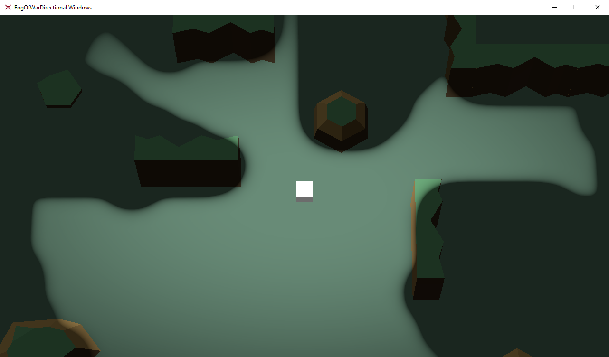
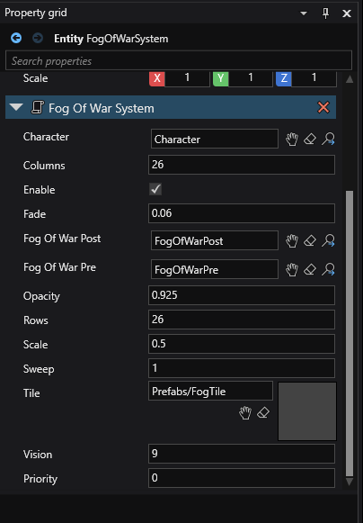

# Xenko FogOfWarDirectional (System)

This is a directional fog of war system written for Xenko, feel free to use it directly or as an example. I am an amature so comments and/or PR's are welcomed. It consists of the following:
- When the project is launched there is a lengthy pause while the fog map is computed
- The fog map is a tile based visibility grid computed from customizable parameters
- Fog parameters are specifed in game studio in/on the FogOfWarSystem class
- There is a fog of war pre material overlaid on the map
- There is a fog of war post material attached to the camera which moves with the player
- A dual camera system, one perspective camera, one orthographic camera
- Orthographic camera renders to a texture in an isolated render group, this is used by the fog of war post material
- Perspective camera has two passes, one for the world, the second for the fog of war
- The fog of war pre material uses a shader which takes an array of floats which equate to opacity
- The fog of war post material is a result of the pre material pumped through a dedicated post effects pipeline
- Fog characteristics can be changed in the post effects settings through game studio (compositor)
- For smoother fog not only can you adjust post effects settings, but also the scale of tiles
- Game profiler is attached, control-shift-p, WASD to move around

*This runs very quickly as it uses merely table lookups and simple up/down logics.
 
 
 
 [Video can be found here](INSERT VIDEO)

**NOTE: Before the scene renders there is a lenghty delay while the fog map is generated. Ideally you would write the fog map/ visiblity data to a JSON or some other custom game data file and read it from disk to avoid the lengthy startup.**

**NOTE: This current project does not handle transparency of enemy units. This can be added easily by registering units with the fog of war system and doing a location lookup (truncation of current Pos) on the fog map, retrieving the Visibility value and pumping it through a transparency shader applied the enemy unit. An example of this can be seen in my [XenkoFogOfWarPlus](https://github.com/devjarmo/XenkoFogOfWarPlus) on the enemy unit shader. This way enemy units or characters will fade into visibility as fog is revealed.**

To use:
- Explore the layout in Game Studio, modify the FogOfWarSystem parameters visibile through game studio.
- Register enemies with the fog of war system by adding the prefab to your entities
